# Dev Dojo - Exercícios de Python

Este projeto reúne exercícios práticos de Python organizados por capítulos. Cada capítulo aborda conceitos fundamentais da linguagem, com exemplos e scripts para facilitar o aprendizado. Os exercícios incluem imagens ilustrativas e links para os códigos correspondentes.

## Índice

- [Capítulo 1 — Variáveis, Tipos de Dados, Constantes, Operadores Aritméticos, Expressões](#capítulo-1---variáveis-tipos-de-dados-constantes-operadores-aritméticos-expressões)
- [Capítulo 2 — Estruturas de Decisão](#capítulo-2---estruturas-de-decisão)
- [Capítulo 3 — Laços de Repetição](#capítulo-3---laços-de-repetição)
- [Capítulo 4 — Vetores](#capítulo-4---vetores)
- [Capítulo 5 — Métodos/Funções](#capítulo-5---métodosfunções)
- [Referências](#referências)

## Capítulo 1 - Variáveis, Tipos de Dados, Constantes, Operadores Aritméticos, Expressões

Exercícios introdutórios sobre variáveis, tipos de dados e operações básicas.

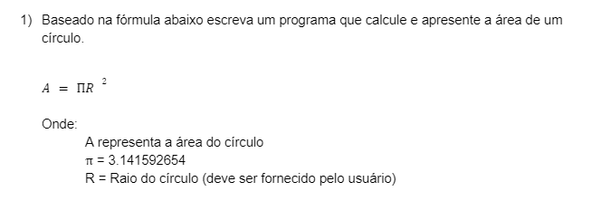

[Script 1.1 - Calcula área do círculo](scripts/capitulo_01/calcula_area_circulo.py)

***

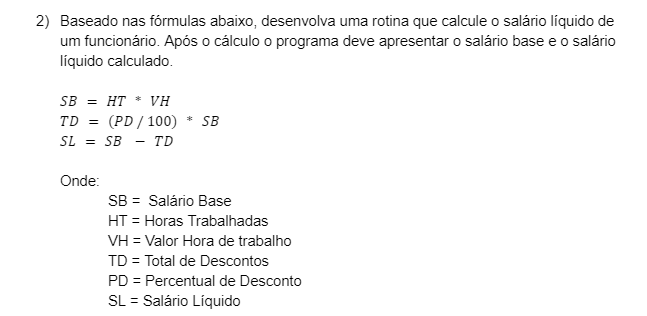

[Script 1.2 - Calcula salário base e líquido](scripts/capitulo_01/calcula_salario_base_e_liquido.py)

***

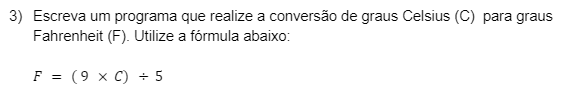

[Script 1.3 - Conversor de temperatura para Fahrenheit](scripts/capitulo_01/conversor_temperatura_fahrenheit.py)

***

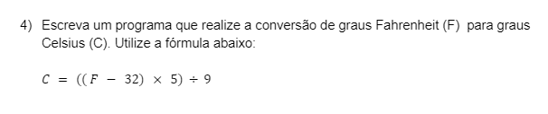

[Script 1.4 - Conversor de temperatura para Celsius](scripts/capitulo_01/conversor_temperatura_celsius.py)

***

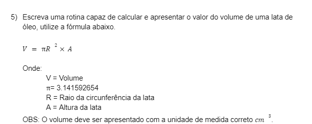

[Script 1.5 - Calcula volume da lata](scripts/capitulo_01/calcula_volume_lata.py)

***

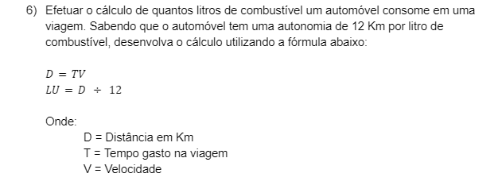

[Script 1.6 - Calcula consumo de combustível](scripts/capitulo_01/calcula_consumo_combustivel.py)

***

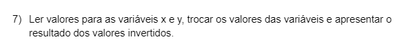

[Script 1.7 - Valores invertidos](scripts/capitulo_01/valores_invertidos.py)

***

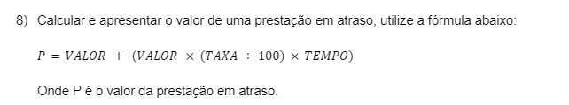

[Script 1.8 - Calcula valor de prestação atrasada](scripts/capitulo_01/calcula_valor_prestacao_atrasada.py)

***

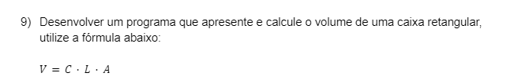

[Script 1.9 - Calcula volume da caixa](scripts/capitulo_01/calcula_volume_caixa.py)

***

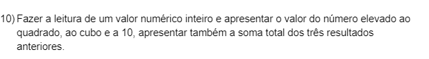

[Script 1.10 - Soma de números elevados](scripts/capitulo_01/soma_numeros_elevados.py)

***

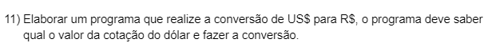

[Script 1.11 - Converter real para dólar](scripts/capitulo_01/conversor_moeda.py)

***

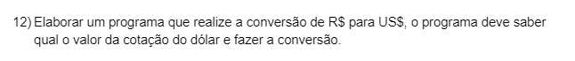

[Script 1.12 - Conversor dólar para real](scripts/capitulo_01/conversor_moeda.py)

***

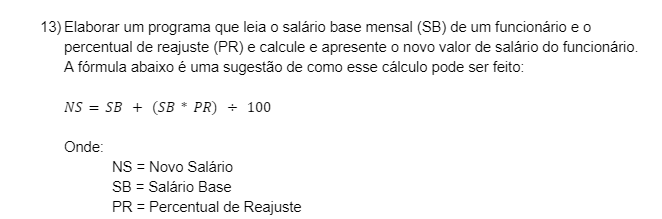

[Script 1.13 - Calcula reajuste salarial](scripts/capitulo_01/calcular_reajuste_salarial.py)

***

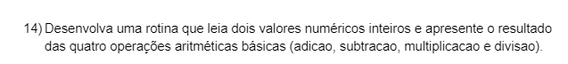

[Script 1.14 - Operações numéricas](scripts/capitulo_01/operacoes_numericas.py)

***

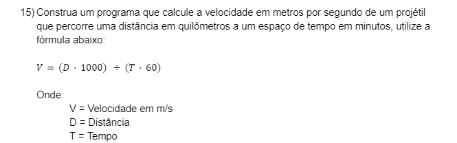

[Script 1.15 - Calcula velocidade de um projétil](scripts/capitulo_01/calcula_velocidade_projetil.py)

***

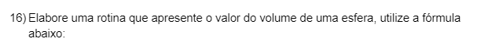

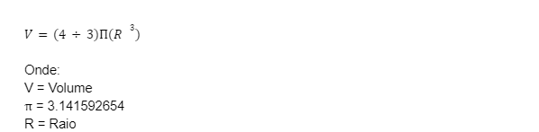

[Script 1.16 - Calcula volume da esfera](scripts/capitulo_01/calcula_volume_esfera.py)

***

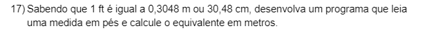

[Script 1.17 - Conversor de pés para metros](scripts/capitulo_01/conversor_unidades_pes_metro.py)

***

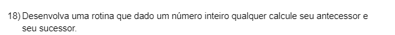

[Script 1.18 - Calcula antecessor e sucessor](scripts/capitulo_01/calcula_antecessor_e_sucessor.py)

***

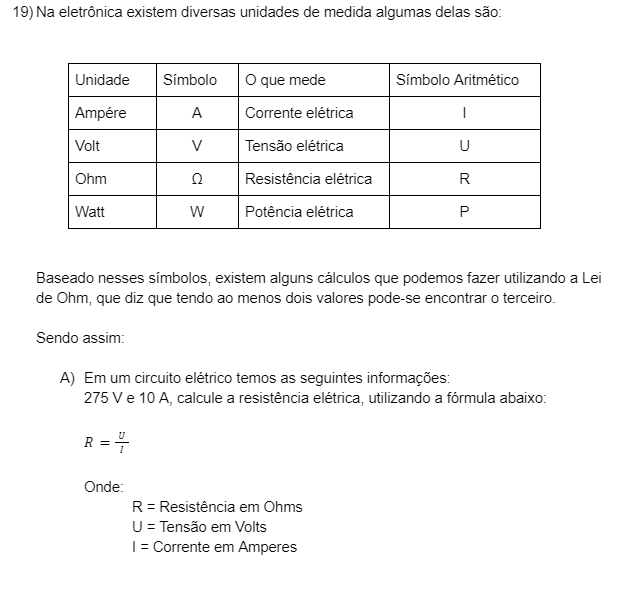

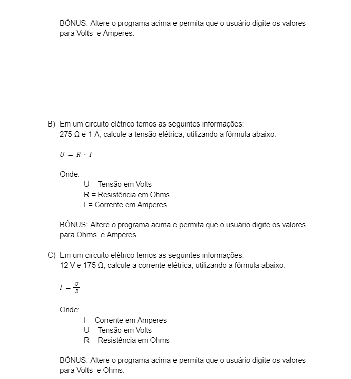

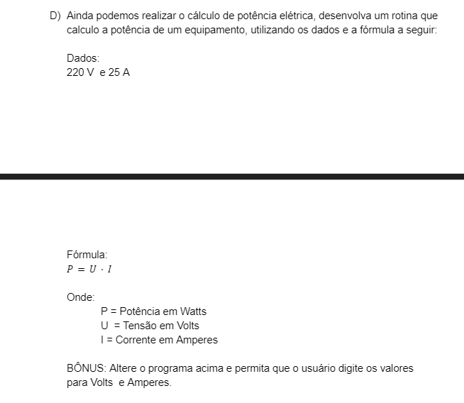

[Script 1.19 - Calculadora elétrica (Lei de Ohm)](scripts/capitulo_01/calcula_leis_ohms.py)

***

## Capítulo 2 - Estruturas de Decisão

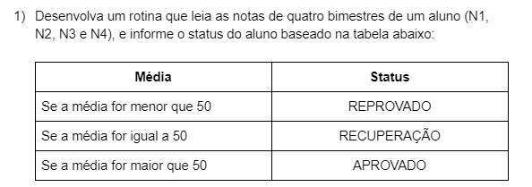

[Script 2.1 – Calcula média e situação do aluno](scripts/capitulo_02/calcular_notas_alunos.py)

***

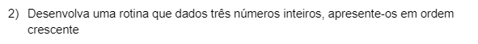

[Script 2.2 – Ordena números em ordem crescente](scripts/capitulo_02/ordena_numeros_ordem_crescente.py)

***

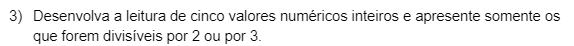

[Script 2.3 – Verifica números divisíveis por 2 e 3](scripts/capitulo_02/numeros_divisiveis.py)

***

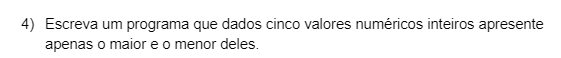

[Script 2.4 – Identifica o maior e o menor número](scripts/capitulo_02/numeros_maior_e_menor.py)

***

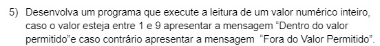

[Script 2.5 – Leitura condicional de valores](scripts/capitulo_02/leitura_condicional.py)

***

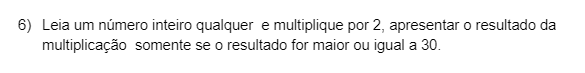

[Script 2.6 – Multiplicação com validação condicional](scripts/capitulo_02/operacao_multiplicao_condicional.py)

***

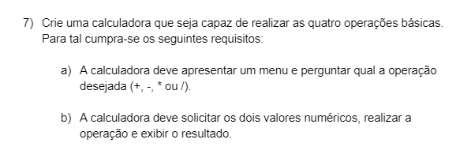

[Script 2.7 – Calculadora básica com menu de operações](scripts/capitulo_02/calculadora_v1.py)

***

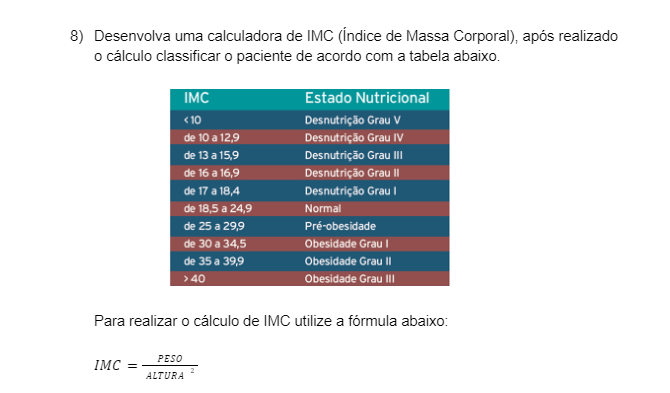

[Script 2.8 – Calculadora de IMC com classificação](scripts/capitulo_02/calculadora_imc.py)

***

## Capítulo 3 - Laços de Repetição

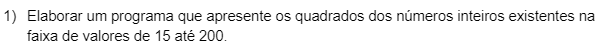

[Script 3.1 - Calcula números elevados ao quadrado](scripts/capitulo_03/calcula_numeros_elevados_quadrado.py)

***

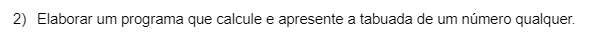

[Script 3.2 - Exibe tabuada de um número](scripts/capitulo_03/tabuada.py)

***

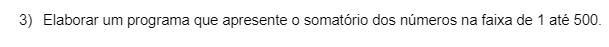

[Script 3.3 - Calcula somatório de números](scripts/capitulo_03/somatorio_numeros.py)

***

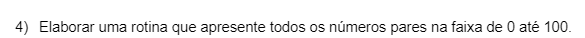

[Script 3.4 - Lista números pares em uma faixa](scripts/capitulo_03/numeros_pares_por_faixa.py)

***

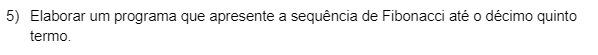

[Script 3.5 - Gera sequência de Fibonacci](scripts/capitulo_03/fibonacci.py)

***

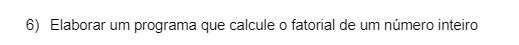

[Script 3.6 - Calcula fatorial de um número](scripts/capitulo_03/calcula_fatorial.py)

***

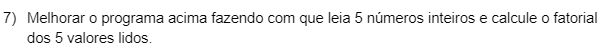

[Script 3.7 - Calcula fatorial de cinco números](scripts/capitulo_03/calcula_fatorial_cinco_numeros.py)

***

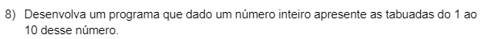

[Script 3.8 - Exibe tabuada de um número](scripts/capitulo_03/tabuada.py)

***

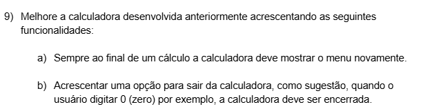

[Script 3.9 - Calculadora básica (versão 2)](scripts/capitulo_03/calculadora_v2.py)

***

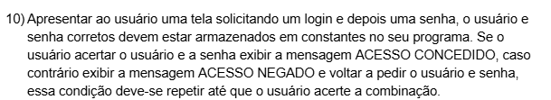

[Script 3.10 - Acesso ao sistema (autenticação)](scripts/capitulo_03/acesso_ao_sistema.py)

***

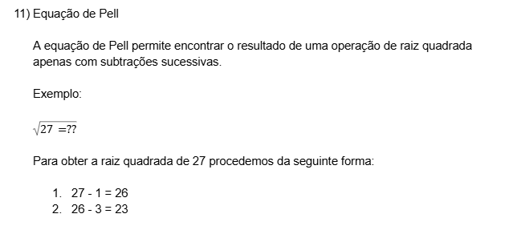

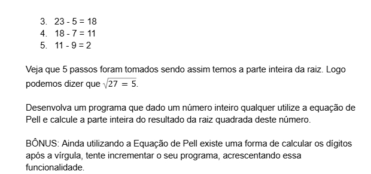

[Script 3.11 - Equação de Pell](scripts/capitulo_03/equacao_pell.py)

***

## Capítulo 4 - Vetores

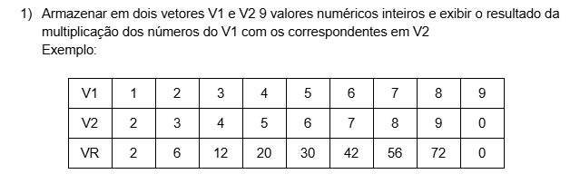

[Script 4.1 - Calcula resultante de vetores](scripts/capitulo_04/calcular_resultante_vetores.py)

***

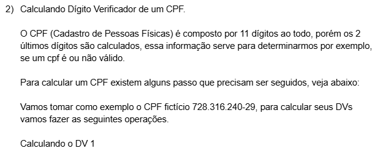

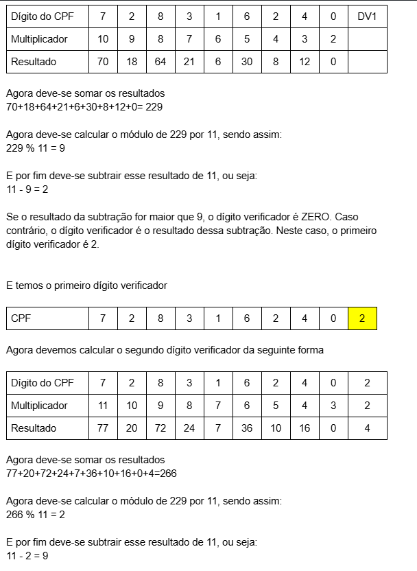

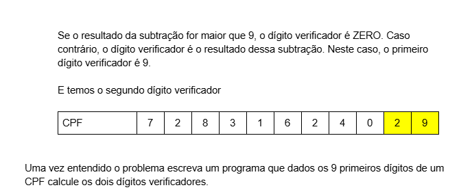

[Script 4.2 - Calcula dígito verificador de CPF](scripts/capitulo_04/calcula_dv_cpf.py)

***

## Capítulo 5 - Métodos/Funções

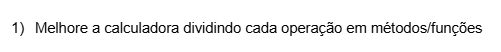

[Script 5.1 - Calculadora básica (versão 3)](scripts/capitulo_05/calculadora_v3.py)

***

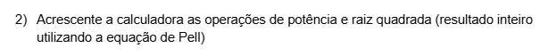

[Script 5.2 - Calculadora básica (versão 4)](scripts/capitulo_05/calculadora_v4.py)

***

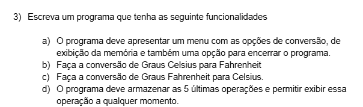

[Script 5.3 - Conversor de temperaturas](scripts/capitulo_05/conversor_temperaturas.py)

***

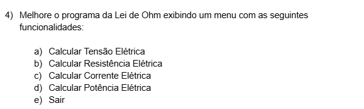

[Script 5.4 - Leis de Ohms](scripts/capitulo_05/lei_ohm.py)

***

[Script 5.5 - Sistema de vendas](scripts/capitulo_05/sistema_vendas.py)

---

## Referências

- [Exercícios Virado no Jiraya](https://docs.google.com/document/d/1yt9gyXl8GbRqqIt_WeZe4zjzKdaH_44i5_3LS8s2zSU/edit?tab=t.0)

---
Sinta-se à vontade para explorar os capítulos e aprimorar seus conhecimentos em Python!